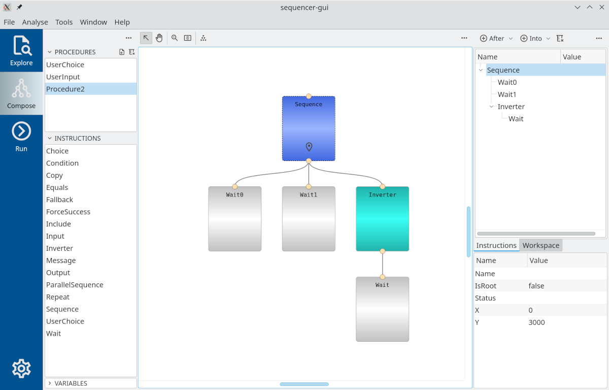

# Sequencer graphical user interface



Prototype of Sequencer Graphical User Interface.

## Installation on CODAC machines

### Install cpp-mvvm library

The `sequencer-gui` application depends on Qt, `cpp-mvvm` and `sequencer` libraries.

```
# install qt5 
yum install codac-core-7.0-qt5.x86_64

# get cpp-mvvm source
git clone https://git.iter.org/scm/coa/cpp-mvvm.git

# compile
mkdir <build>; cd <build>
PATH=/opt/codac/qt5/bin:$PATH cmake <source>
make -j4 && ctest
```

Please note, that thanks to CMake magic (the magic is located in $HOME/.cmake directory), installation is optional.
Without installation, libraries will be discoverable right from the build directory.

### Build sequencer-gui

```
# Get source code (develop branch)
git clone -b develop https://git.iter.org/scm/coa/sequencer-gui.git

# Compile
<build>mkdir build; cd build
PATH=/opt/codac/qt5/bin:$PATH cmake <source>
make -j4 && ctest

# Run
<build>/bin/sequencer-gui
```

## Installation on custom Linux

It is possible to develop Sequencer GUI on custom Linux distributive. Tested on `Arch` Linux.

`cpp-mvvm` library and `coa-compact` must be compiled before.
It is perfectly fine not to install libraries after the build. 
Thanks to CMake magic they will be discovered and used right from the `build` directories.
Make sure that `build` directories are different.

```
# build cpp-mvvm library
git clone https://git.iter.org/scm/coa/cpp-mvvm.git
mkdir <build>; cd <build>
cmake <source> && make -j4 && ctest

# build coa-compact library
git clone https://git.iter.org/scm/coa/coa-compact.git
mkdir <build>; cd <build>
cmake <source> && make -j4

# build Sequencer GUI
git clone -b develop https://git.iter.org/scm/coa/sequencer-gui.git
mkdir <build>; cd <build>
cmake <source> && make -j4 && ctest

# Run
<build>/bin/sequencer-gui
```
