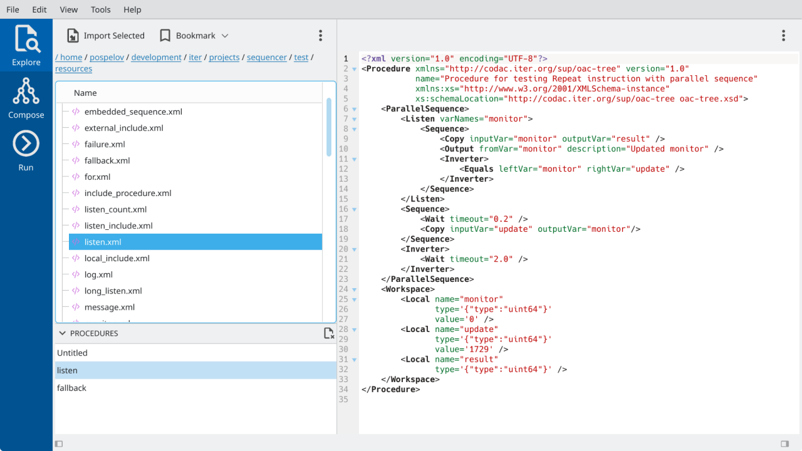
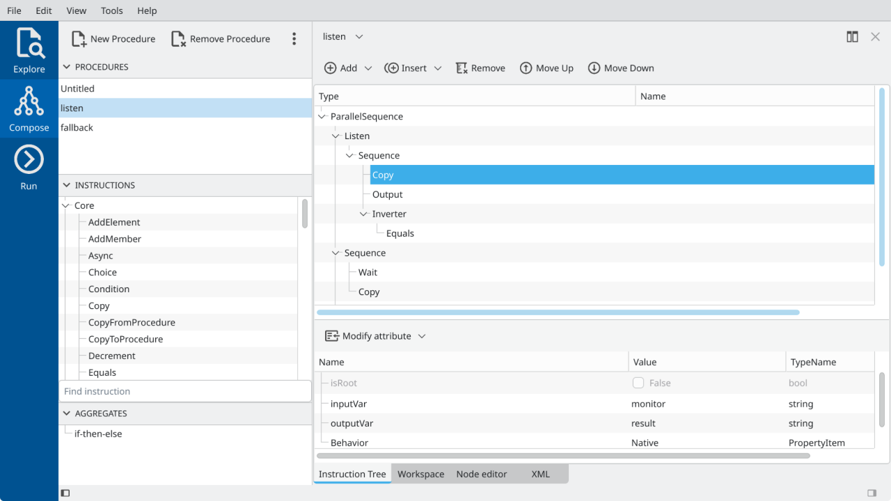
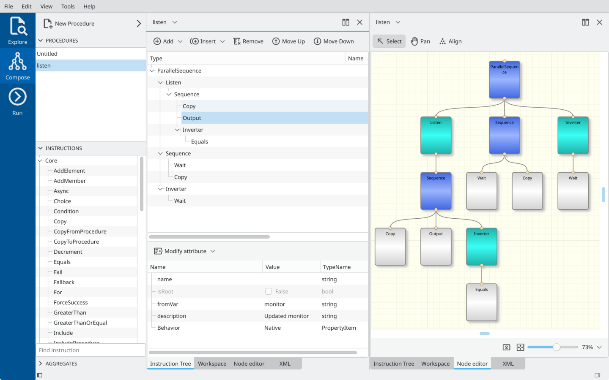
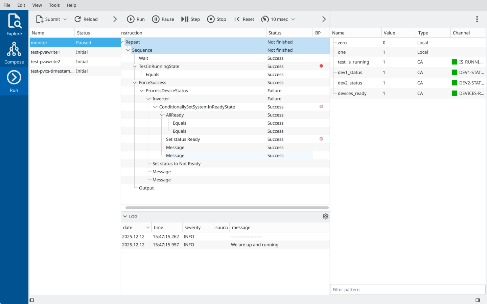

# Graphical User Interface for ITER Sequencer (oac-tree)

This repository contains the source code for the Graphical User Interface 
of ITER Sequencer, also known as `oac-tree`. The `oac-tree` is a C++ framework for creating 
and executing automation procedures based on the behavioral trees.
It is developed in the context of the ITER Supervision and Automation System (SUP).

The Graphical User Interface is intended to simplify various aspects of work with `oac-tree`, including browsing,
editing, execution, and debugging of automation procedures.

## Links

- [oac-tree framework on GitHub](https://github.com/oac-tree)
- [oac-tree GUI documentation on GitHub](https://oac-tree.github.io/oac-tree-docs/oa/oac-tree-gui/index.html)
- [CODAC Operation Applications](https://coa.iter.org/)

## Screenshots

Explorer view

Composer view

Composer view (InstructionTree and NodeEditor panels)

Operation view (Real-time instruction tree with breakpoints and variable table)

## Dependencies

- C++-17
- CMake >= 3.14
- gtest >= 1.12
- libxml2
- Qt6 (base, tools, charts, svg)
- oac-tree and plugins

*Note:* Qt5 is also possible with `-DCOA_USE_QT6=OFF` flag

**oac-tree and plugins**

- sup-utils
- sup-dto
- sup-di
- sup-protocol
- sup-epics
- sequencer
- sequencer-plugin-epics
- sup-auto-server
- sup-mvvm
- sup-gui-extra
- sup-gui-core
- sequencer-gui

