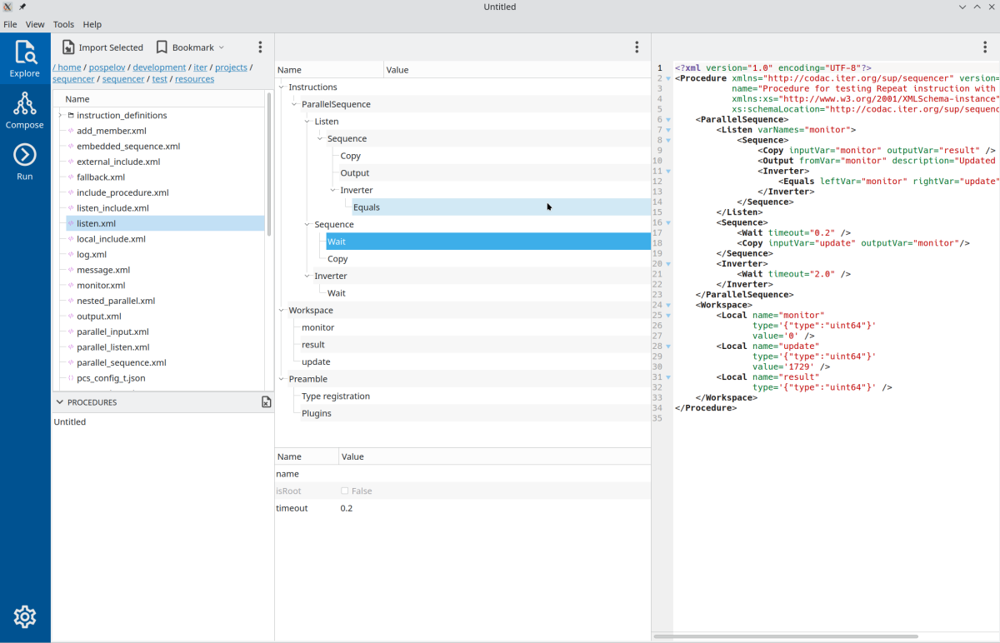
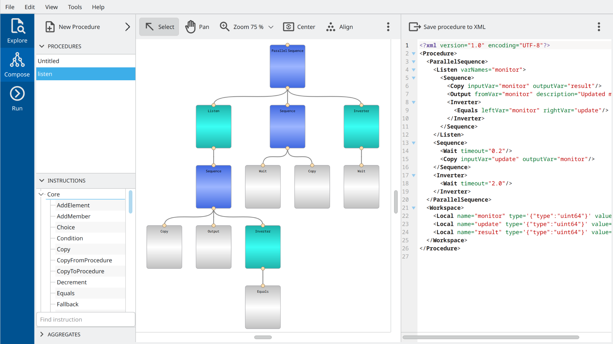
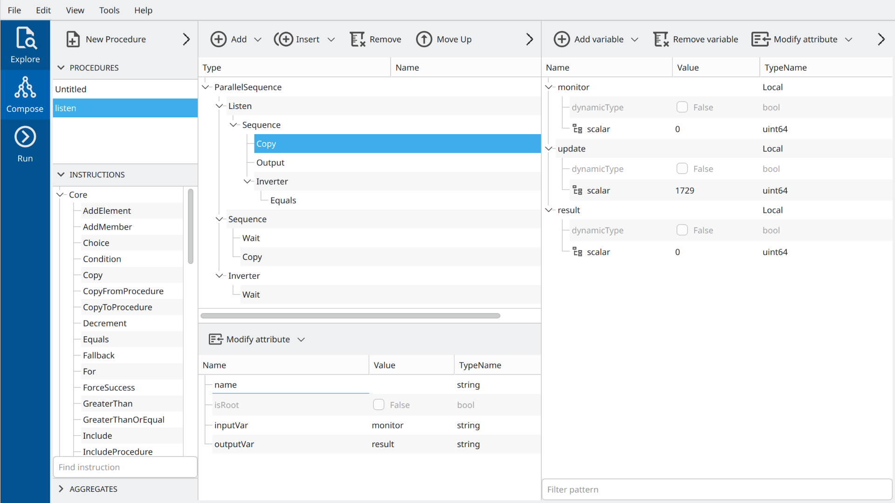
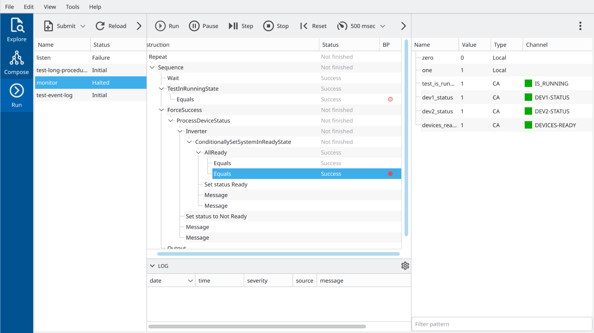

# Sequencer Graphical User Interface



Explorer view



Composer view (NodeEditor and InstructionTree panels)



Composer view (InstructionTree and Workspace panels)



Operation view (Real-time instruction tree with breakpoints and variable table)

## Installation on CODAC machines from RPMs

```bash
yum install codac-core-7.2-sequencer-gui.x86_64
```

## Run

- /opt/codac/bin/sequencer-gui

Other applications:

- /opt/codac/bin/sequencer-operation
- /opt/codac/bin/sup-pvmonitor
- /opt/codac/bin/anyvalue-editor

## Installation on CODAC machines (manual)

The `sequencer-gui` application depends on a number of Codac Operation Application libraries.

### Install prerequisites

```bash
yum install codac-core-7.2-gtest-1.12.1-devel.x86_64 libxml2-devel.x86_64
yum install qt5-qtbase-devel.x86_64 qt5-qtsvg-devel.x86_64 qt5-qttools-devel.x86_64 qt5-qtbase-gui.x86_64 qt5-qtcharts-devel.x86_64 adwaita-qt5.x86_64 mesa-libGL-devel.x86_64
```

### Install COA packages

Checkout packages from [COA git](https://git.iter.org/projects/COA/repos/sup-utils/browse
) and install them one-by-one using `mvn clean install`

- sup-utils
- sup-dto
- sup-di
- sup-protocol
- sup-epics
- sequencer
- sequencer-plugin-epics
- sup-auto-server
- sup-mvvm
- sup-gui-extra
- sup-gui-core
- sequencer-gui

## Installation on custom Linux

All COA packages are ordinary CMake packages and they can be compiled and installed on any Linux
of user choice like any other CMake project. Here we show the installation of `sup-utils` package. 
All others have to be installed in a similar way in the order given by the list above.
We assume that the user wants to install all dependencies into `<path-to-local-install>` (e.g. /opt/local).

```bash
git clone https://git.iter.org/scm/coa/sup-utils.git
mkdir <build>; cd <build>
cmake -DCMAKE_PREFIX_PATH=<path-to-local-install> -DCMAKE_INSTALL_PREFIX=<path-to-local-install> <path-to-repo>
make -j4; ctest; make install
```

It might be needed to add `<path-to-local-install>/lib` to `LD_LIBRARY_PATH`.

## Alternative installation on custom Linux

This method doesn't require installation, all packages will be used from their `<build>` directories
thanks to CMake magic (the magic is located in $HOME/.cmake directory). Use `-DCOA_EXPORT_BUILD_TREE=ON` 
during CMake configuration phase.

```bash
git clone https://git.iter.org/scm/coa/sup-utils.git
mkdir <build>; cd <build>
cmake -DCOA_EXPORT_BUILD_TREE=ON <path-to-repo>
make -j4; ctest
```

