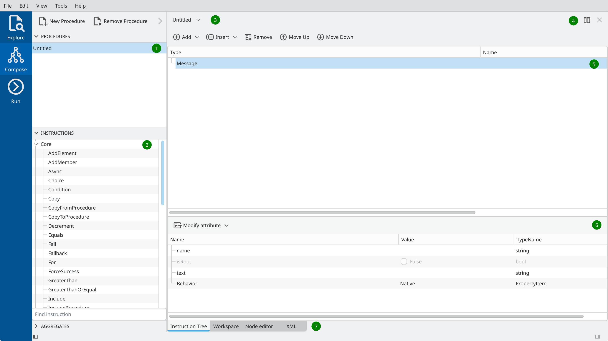

Overview
========

Main GUI views
---------------

The main oac-tree GUI can be started by running executable ``bin/oac-tree``.
An empty window as shown in *Figure 1* will appear on startup.

.. image:: screenshots/overview-explorer.png
  :width: 960

The vertical blue tab bar on the left allows switching between three main views:

1. The *Explore* view is intended to browse existing sequencer procedures on disk.
2. The *Compose* view allows you to modify existing procedures or assemble new ones by defining an instruction tree and variables.
3. The *Run* view is intended for running the sequencer procedure.

Explorer view
-------------

The Explorer view allows browsing procedures on disk and checking their composition.
It consists of 3 main widgets, marked in *Figure 2* with green bullets:

.. image:: screenshots/overview-explorer-details.png
  :width: 960

1. The file browser on the left for navigating the filesystem on your computer.
2. The XML viewer on the right with the XML representation of the selected sequencer procedure.
3. The procedure list at the bottom with currently opened procedures.

The possible workflow in the Explorer view could be as follows:
The user browses directories and finds the procedure they want to edit or execute.
By using the *Import Selected* button located on the toolbar of the file browser,
or by simply double-clicking on a file name, the procedure can be imported into the
program's memory and will appear in the procedure list. 

At program start-up, this list already contains a single empty *Untitled* procedure.
There can be multiple procedures simultaneously opened/edited in the program.
The user can edit these procedures in the `Composer` view.

Please note that the GUI never modifies files with sequencer procedures used for import, unless
it is explicitly asked to export the result of the work.

Composer view
-------------

The Composer view allows editing previously imported procedures or creating new
ones from scratch. *Figure 3* presents the default layout with a tool panel on
the left, and a procedure editor on the right. The tool panel contains a list of
opened procedures and a list of instructions available for sequence
composition. The procedure editor represents a multi-tab area, where the user
can edit the instruction tree (in the form of a tree and in the form of a node
editor), workspace variables, and check the XML representation of the procedure.
The area can be additionally split to edit multiple procedures simultaneously.

The important widgets are marked with green labels and explanations
are given below:

1. List of currently opened procedures. All procedures that have been already
   imported from the disk will appear in this list. The user can also create new
   empty procedures using corresponding icons on the widget's toolbar.
2. A toolbox with sequencer instructions grouped according to their plugin
   names. The instructions can be dragged and dropped to the node editor, or to the instruction tree.
3. A combo box that allows you to quickly switch between loaded procedures.
4. A split button that allows you to create multiple panels to edit several procedures simultaneously.
5. Instruction tree. In the given example the tree contains only one single Message instruction.
6. Instruction property editor. It shows the concrete properties of the
   instruction currently selected in the instruction tree (here properties of the `Message` instruction).
7. Editor tab selector. It allows switching between instruction tree editor, workspace
   editor, node editor (which is an alternative form of instruction editor) and XML viewer.

*Figure 4* below shows an example of a layout, where the same procedure with the
name "fallback" is opened in both central and right panels. The central panel is
used to edit instruction sequencer in the `Instruction Tree Editor`, while the
right panel presents the same tree in the form of graphical `Node Editor`.

.. image:: screenshots/overview-composer2.png
  :width: 960

Run view
--------

The Run view is intended for procedure execution. It consists of 4 main widgets as shown in *Figure 5*:

.. image:: screenshots/overview-run.png
  :width: 960

1. Job list view. It shows all currently running, paused, idle, or stopped jobs.
   To submit the procedure for execution one has to add it to the list of jobs
   using a toolbar. 
2. Main real-time instruction tree view. It contains an instruction tree of the
   currently selected job. A number of control buttons on top of the view allow
   you to start, stop, and pause the job execution.
3. The log window shows all output generated by the currently selected job.
4. The sequencer variable workspace shows the actual state of all variables of
   the currently selected job.

The possible workflow can be the following. The user prepares a procedure to run
using the main *Compose* view. Then they switch to the *Run* view and submit
the procedure for execution using a *Submit* button on a toolbar. Then the user
starts the job in stepwise mode and controls its further execution.

It is important to note that the job is linked to the original procedure as it
was at the moment of job creation. Every consecutive run of a job will execute
that procedure. To pick up all possible changes made to the original procedure
in the *Compose* view, the job has to be reloaded using the *Reload* button on a
toolbar.
