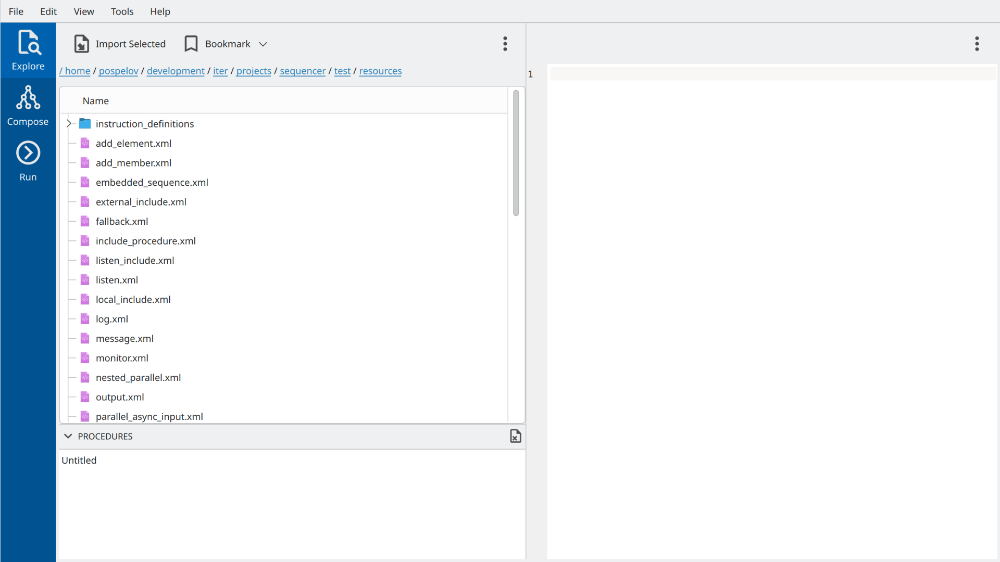

Overview
========

Main GUI views
---------------

The main OACTree GUI can be started by running executable ``bin/sequencer-gui``.
The empty windows as in *Figure 1* will appear on startup.

The vertical tab bar on the left allows switching between three main views:

1. The explorer view is intended to quickly browse existing sequencer procedures on disk.
2. The composer view allows modify existing procedures or assemble new ones by defining instruction tree and variables.
3. The run view is intended for running sequencer procedure.

Explorer view
-------------

An explorer view allows quickly browsing procedures on disk and checking their composition.
It consists of 3 main widgets, as marked in *Figure 2* with green bullets:

.. image:: screenshots/overview-explorer-details.png
  :width: 960

1. The file browser on the left to navigate through files on disk.
2. The XML viewer with XML representation of selected sequencer procedures.
3. The procedure list at the bottom with currently opened procedures.

The possible workflow in the explorer view could be as follows:
The user browses directories and finds the procedure he wants to edit or execute.
By using the *Import Selected* button located on the toolbar of the file browser,
or by simply double-clicking on a file name, the procedure can be imported into the
program's memory and will appear in the procedure list.

At the program start-up, the list contains already one single untitled empty procedure.
There can be multiple procedures simultaneously opened/edited in the program.

Please note, that the GUI never modifies files with sequencer procedures used for import, unless
it is explicitly asked to export the result of the work.

Composer view
-------------

A composer view allows editing previously imported procedures or creating new ones from scratch.
It has three main vertical panels containing various widgets related to the instruction tree and
variable workspace composition. Panels are configurable and can be adjusted up to some extent to
match current activity. *Figure 3* presents one of the possible layouts with following five main
widgets:

.. image:: screenshots/overview-composer.png
  :width: 960

1. List of currently opened procedures. All procedures that have been already imported from the disk will appear in this list. The user can also create new empty procedures using corresponding icons on the widget's toolbar.
2. A toolbox with sequencer instructions grouped according to their plugin names.
3. Instruction tree. Current tree contains only one single Messae instruction
4. Instruction property editor. It shows the concrete properties of the instruction currently selected in the instruction tree.
5. Workspace editor. This widget allows populating the sequencer workspace with variables.

