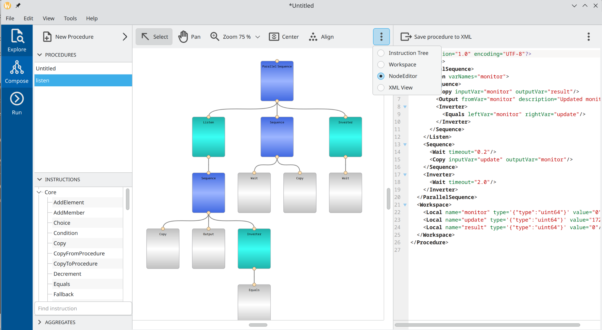

Overview
========

Main GUI views
---------------

The main OACTree GUI can be started by running executable ``bin/sequencer-gui``.
The empty windows as in *Figure 1* will appear on startup.

.. image:: screenshots/overview-explorer.png
  :width: 960

The vertical blue tab bar on the left allows switching between three main views:

1. The *Explore* view is intended to quickly browse existing sequencer procedures on disk.
2. The *Compose* view allows modify existing procedures or assemble new ones by defining instruction tree and variables.
3. The *Run* view is intended for running sequencer procedure.

Explorer view
-------------

An explorer view allows quickly browsing procedures on disk and checking their composition.
It consists of 3 main widgets, as marked in *Figure 2* with green bullets:

.. image:: screenshots/overview-explorer-details.png
  :width: 960

1. The file browser on the left for navigating the filesystem on your computer.
2. The XML viewer with XML representation of selected sequencer procedure.
3. The procedure list at the bottom with currently opened procedures.

The possible workflow in the explorer view could be as follows:
The user browses directories and finds the procedure he wants to edit or execute.
By using the *Import Selected* button located on the toolbar of the file browser,
or by simply double-clicking on a file name, the procedure can be imported into the
program's memory and will appear in the procedure list.

At the program start-up, this list contains already one single empty *Untitled* procedure.
There can be multiple procedures simultaneously opened/edited in the program.

Please note, that the GUI never modifies files with sequencer procedures used for import, unless
it is explicitly asked to export the result of the work.

Composer view
-------------

A composer view allows editing previously imported procedures or creating new ones from scratch.
It has three main vertical panels containing various widgets related to the instruction tree and
variable workspace composition.  *Figure 3* presents one of the possible layouts with the following
five main widgets:

.. image:: screenshots/overview-composer.png
  :width: 960

1. List of currently opened procedures. All procedures that have been already imported from the disk will appear in this list. The user can also create new empty procedures using corresponding icons on the widget's toolbar.
2. A toolbox with sequencer instructions grouped according to their plugin names.
3. Instruction tree. In the given example the tree contains only one single Message instruction.
4. Instruction property editor. It shows the concrete properties of the instruction currently selected in the instruction tree.
5. Workspace editor. This widget allows populating the sequencer workspace with variables.

Please note, that the current selection in the list of procedures (1) located on the left panel,
affects the content of two other panels. The instruction tree (4) and workspace editor (5) always show
the content related to the currently selected procedure.

Panels are configurable and can be up to some extent adjusted to match current activity.
By using the 3-dots selector in the right corner of a panel the content can be changed. *Figure 4* shows
the layout with the instruction tree of nodes placed at the center, and the XML of the whole procedure on the right.

Run view
--------

A job view is intended for procedure execution. It consists of 5 main widgets as given on *Figure 5*:

.. image:: screenshots/overview-run.png
  :width: 960

1. Job list view. It shows all currently running, paused, idle, or stopped jobs. To submit the procedure for execution one has to add it to the list of jobs using a toolbar.
2. Main real-time instruction tree view. It contains an instruction tree of the currently selected job. A number of control buttons on top of the view allow you to start, stop, and pause the job execution.
3. The log window shows all output generated by the currently selected job.
4. The sequencer variable workspace shows the actual state of all variables of the currently selected job.

The possible workflow can be the following. The user prepares a procedure to run using the
main *Compose* view. Then he switches to the *Run* view and submits the procedure for execution using
a *Submit* button on a toolbar. Then user starts the job in stepwise mode and controls its further
execution.

It is important to note, that the job is linked to the original procedure as it was at the moment
of job creation. Every consecutive run of a job will execute that procedure.
To pick up all possible changes made to the original procedure in the *Compose* view the job has to be
reloaded using the *Reload* button on a toolbar.
