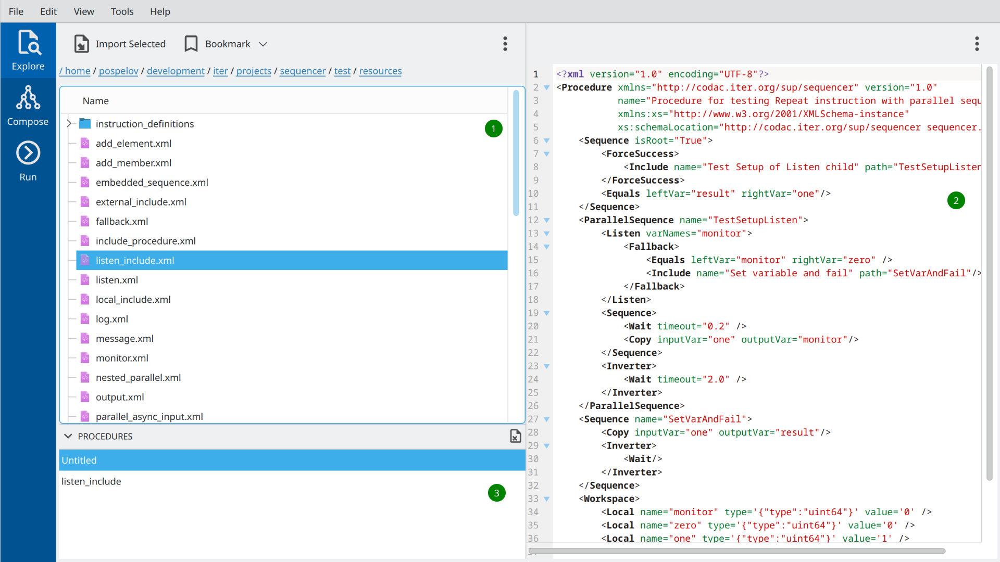

Overview
========

Main GUI views
---------------

The main OACTree GUI can be started by running executable ``bin/sequencer-gui``.
The empty windows as in *Figure 1* will appear on startup.

.. image:: screenshots/overview-explorer.png
  :width: 960

The vertical tab bar on the left allows switching between three main views:

1. The explorer view is intended to quickly browse existing sequencer procedures on disk.
2. The composer view allows modify existing procedures or assemble new ones by defining instruction
tree and variables.
3. The run view is intended for running sequencer procedure.

Explorer view
-------------

An explorer view allows quickly browsing procedures on disk and checking their composition.
It consists of 3 main widgets, as marked in *Figure 2* with green bullets:

1. The file browser on the left to navigate through files on disk.
2. The XML viewer with XML representation of selected sequencer procedures.
3. The procedure list at the bottom with currently opened procedures.

The possible workflow in the explorer view could be as follows:
The user browses directories and finds the procedure he wants to edit or execute.
By using the *Import Selected* button located on the toolbar of the file browser,
or by simply double-clicking on a file name, the procedure can be imported into the
program's memory and will appear in the procedure list (3).

At the program start-up, the list contains already one single untitled empty procedure.
There can be multiple procedures simultaneously opened/edited in the program.
